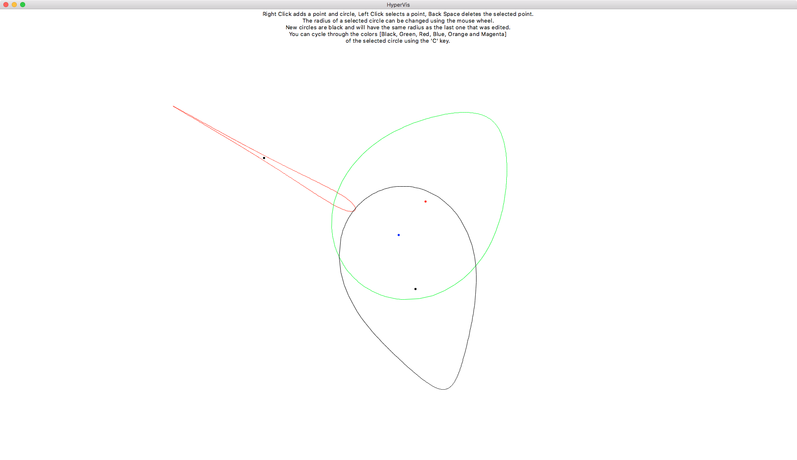

## HyperVis

HyperVis is a Python tool that visualizes circles and lines in hyperbolic space using its
native representation.

# Installation
1. Make sure you have Python 3 installed
1. Install [Tk](http://www.tkdocs.com/tutorial/install.html) if not installed already.
1. Download the code from this repository.

# Usage
Launch the tool by calling `python3 HyperVis.py`
If you plan on saving your drawing as SVG or Ipe, use the `>` operator to write into a file, e.g.:
`python3 HyperVis.py > drawing.svg` or `python3 HyperVis.py > graphic.ipe`

# Controls
* `Right Click` adds a circle centered at the current location of the mouse
* `Shift Right Click` adds a point without a circle
* `Left Click` on a point selects the point and the circle that it is centered in
* `Shift Left Click` adds to selection
* `Mouse Drag` moves the circle on the plane
* `BackSpace` deletes a selected point
* `Mouse Wheel` or `+` or `-` changes the size of the selected circle
* `O` adds a circle centered at the origin
* `E` adds an edge between all selected points
* `C` cycles through the colors of the selected circle `[Black, Green, Red, Blue, Orange and Magenta]`
* `S` prints the drawing as SVG (use `>` operator when launching HyperVis to write into a file)
* `I` prints the drawing as Ipe (use `>` operator when launching HyperVis to write into a file)

# Notes
* The blue point at the center represents the origin of the hyperbolic plane
* New circles are black and have the same size as the last circle that was edited
* Trying to add an edge between two already connected points will remove the edge

# Known Issues
* Tk does not seem to recognize mouse scroll events in macOS High Sierra
